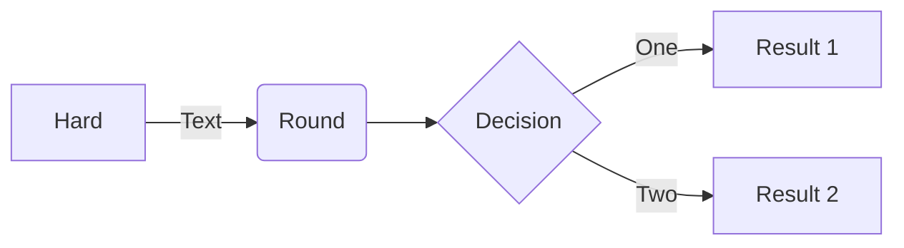

# ReportSalesCoffee
**ความเป็นมาของโปรแกรม**
```
เนื่องจากในตอนเด็กผมอยากกิจการร้านกาแฟเล็กๆเป็นของตัวเอง ผมจึงสร้างโปรแกรมนี้ขึ้นมา
```
**วัตถุประสงค์ของโปรแกรม**
```
โปรแกรมนี้สร้างขึ้นเพื่อที่จะบันทึกว่าในเเต่ละวันมีการขายกาแฟและของหวานไปเท่าไหร่
```
**Class diagram**

**เจ้าของโปรแกรม**
```นาย ศรันย์ ซุ่นเส้ง```
